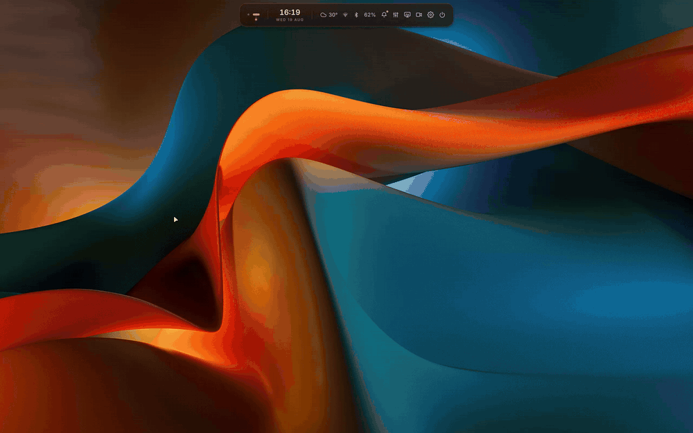

# CapsuleOS

A Hyprland rice built around one pill.

The whole shell is a single capsule-shaped bar. Click it and it morphs into
what you need: media, calendar, mixer, wallpaper picker, clipboard, launcher,
settings. No panels, no widgets scattered around, just the pill.

The look is night-bridge: dark glass, fog grey, amber accents.

Forked from [Ricelin](https://github.com/Gakuseei/Ricelin), whose hand-written
Quickshell pill is the entire base. Go star it.

## Tour

| | |
|---|---|
|  | Every surface grows out of the same bar and folds back in. Network, bluetooth, screen recording and the lock screen included. |
|  | `Super+N` shuffles the wallpaper and recolors the whole desktop from it: shell, borders, terminal, lock screen. Don't like it? Press it again. |

## What you get

- Three materials: glass, frost or ink. Pick how see-through you want things.
- Motion presets (calm, spring, glide) that drive the shell and Hyprland
  together, with a curve editor tucked away if you want to fiddle.
- The pill hides off the top edge when you're not using it. Mouse up to get
  it back.
- Settings for everything: appearance, windows, displays, input, keybinds,
  workspaces, recording, wallpaper, session. Searchable. You rarely need to
  open a config file.
- Do-not-disturb, keep-awake, game mode, night light and idle lock, one
  click deep.

## Stack

Hyprland (Lua config) · Quickshell · ghostty · zsh · Inter + JetBrains Mono Nerd · matugen

## Install

> Young installer. Read it first, keep backups.

    curl -fsSL https://raw.githubusercontent.com/arubatoclaud/CapsuleOS/main/install.sh | bash

Works on Arch, Debian/Ubuntu, Fedora and openSUSE families.

| Flag | |
|---|---|
| `--quickstart` | defaults, no questions |
| `--full` | also grab the daily-driver apps |
| `--sddm` | the goldengate login theme |
| `--no-deps` | configs only, no root needed |
| `--dry-run` | show what would happen, change nothing |
| `--reinstall` | rerun the wizard on an existing install |
| `--uninstall` | put things back |

No root? Use `--no-deps` and install `installer/packages.json` however you
like. Fonts work fine in `~/.local/share/fonts`.

Your `~/.zshrc` is never touched and your monitor layout is never overwritten.

## Day to day

    capsuleos status     what's running, which version
    capsuleos update     check, read the changelog, apply, restart
    capsuleos restart    cycle the shell
    capsuleos log        follow the shell log

`update` keeps files you've customised and backs everything up with a
timestamp before touching anything.

## Keybinds

The starter set. Rebind anything in Settings → Keybinds.

| Key | Action |
|---|---|
| `Super` + `Q` | terminal |
| `Super` + `Space` | app launcher |
| `Super` + `V` | clipboard history |
| `Super` + `B` | wallpaper picker |
| `Super` + `N` | shuffle wallpaper + retheme |
| `Super` + `E` | file manager |
| `Super` + `T` | toggle floating |
| `Super` + `L` | lock |

## Wallpapers

None bundled yet. See [WALLPAPERS.md](WALLPAPERS.md) for ideas, drop images in
`~/CapsuleOS/wallpapers`, or point the picker anywhere in Settings → Wallpaper.

## Credits

The pill, the installer and the update engine are
[Gakuseei's Ricelin](https://github.com/Gakuseei/Ricelin), reskinned.
Lock/SDDM asset credits: [CREDITS](configs/sddm/themes/goldengate/CREDITS.md).
